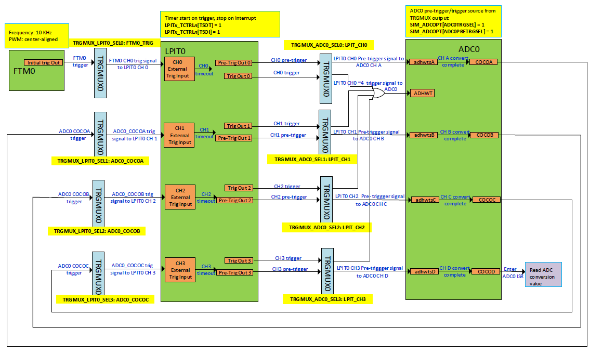
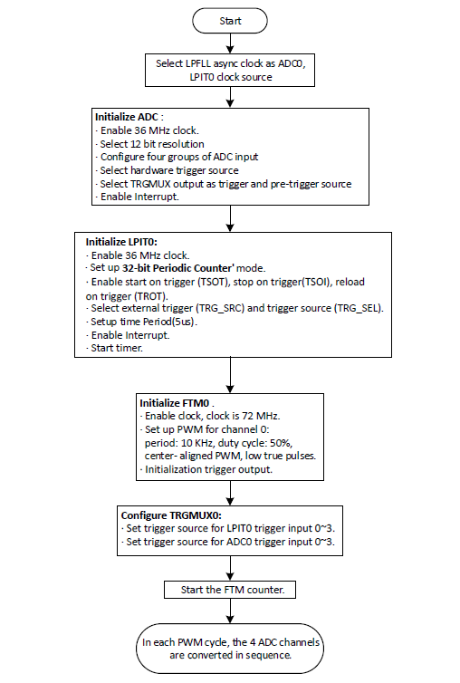
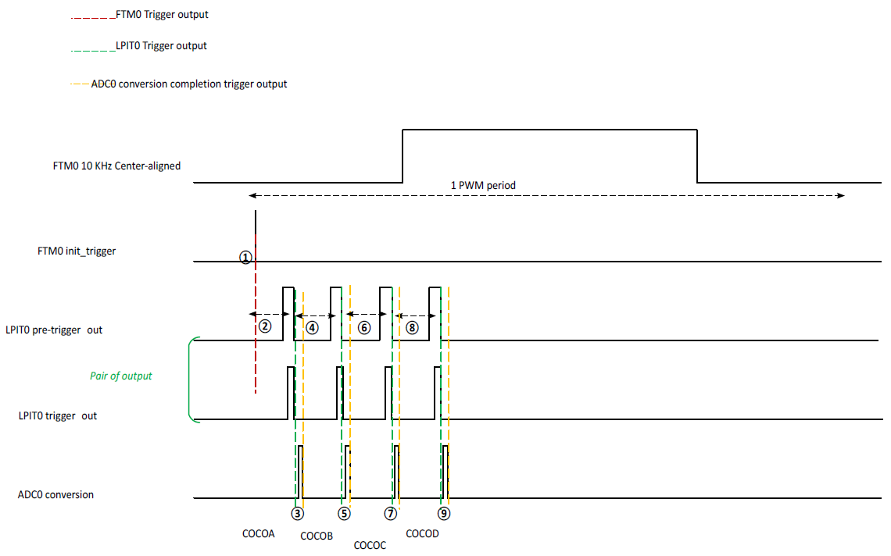
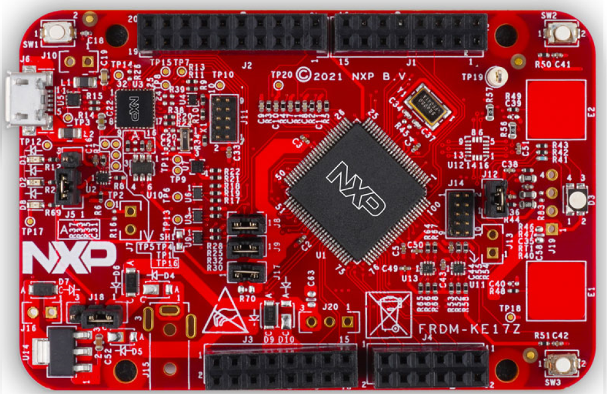

# NXP Application Code Hub

## AN13437: Using KE17Z LPIT to Trigger ADC Multi-channel Conversion

This demo shows the process of using LPIT to achieve FTM triggering the alternate conversion of four ADC channels in one PWM cycle.

Please refer to AN13437 for complete instructions on how to use this software.

 https://www.nxp.com.cn/docs/en/application-note/AN13437.pdf.

In BLDC motor control application, users always use FTM to trigger ADC multiple channels convert alternately. 

However, the ADC of KE17Z does not support sampling in sequence, so it needs LPIT to provide alternate ADC hardware trigger source. TRGMUX implementation enables to realize ADC sampling in sequence in one PWM period. LPIT can also provide precise timing interval as the trigger delay between the conversion of ADC multi-channels.

The figure below shows the process of using LPIT to achieve FTM triggering the alternate conversion of four ADC channels in one PWM cycle:

#### Boards: FRDM-KE17Z
#### Categories: Industrial
#### Peripherals: ADC, PWM, LPIT
#### Toolchains: IAR

## Table of Contents
1. [Software](#step1)
2. [Hardware](#step2)
3. [Setup](#step3)
4. [Result](#result)
5. [Support](#step6)
6. [Release Notes](#step7)

## 1. Software

The development environment of example code is development on IAR embedded Workbench 9.10.2, based on SDK_2_10_1_FRDM-KE17Z.

The software flowchart of the using  LPIT to trigger ADC multi-channel conversion  is shown below:

The timing of LPIT0 output trigger/pre-trigger to ADC0:

## 2. Hardware

- Micro USB cable

- FRDM-KE17Z board.

- Personal Computer

  

​                                                                           FRDM-KE17Z board

## 3. Setup

1. Connect a USB cable between the host PC and the OpenSDA USB port on the target board.
2. Open a serial terminal with the following settings:
   - 115200 baud rate
   - 8 data bits
   - No parity
   - One stop bit
   - No flow control
3. Download the program to the target board.
4. Either press the reset button on your board or launch the debugger in your IDE to begin running the demo.

## 4. Result 

When the example runs successfully, you can see the similar information from the terminal as below:

*FTM0 trigger LPIT0, LPIT0 trigger four ADC channels conversion*

*ADC12 Conversion Completed, result value: 835,10,0,3015*

## 5. Support

For more details, please refer to AN13437 on NXP web.

#### Project Metadata
<!----- Boards ----->

<!----- Categories ----->

<!----- Peripherals ----->
  

<!----- Toolchains ----->

Questions regarding the content/correctness of this example can be entered as Issues within this GitHub repository.

>**Warning**: For more general technical questions regarding NXP Microcontrollers and the difference in expected funcionality, enter your questions on the [NXP Community Forum](https://community.nxp.com/)

## 6. Release Notes
| Version | Description / Update                           | Date                        |
|:-------:|------------------------------------------------|----------------------------:|
| 1.0     | Initial release on Application Code HUb        | June 5th 2023 |

